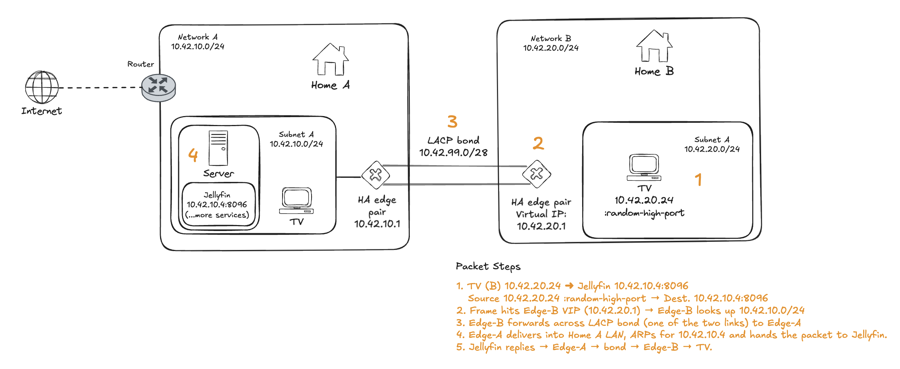
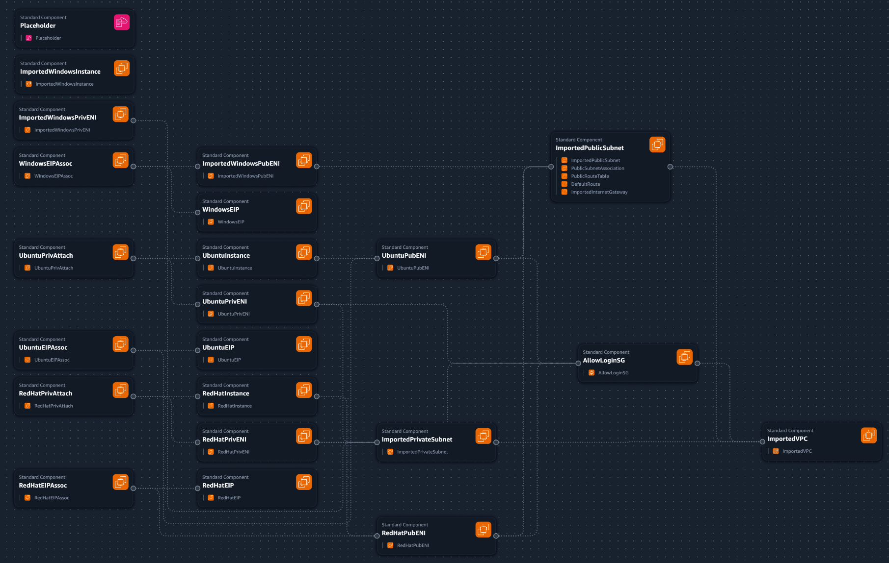

# Networking Fundamentals Bootcamp

Add High Level Repository Structure.

## "Stand-up" updates

2025-06-07/08/09/10

Followed the Week1 tutorials:

- **Cloud Networking**. See [Journal](projects/week1/cloud_networking/JOURNAL.md).
- **Linux Firewall Rules**. See [Journal](projects/week1/linux_firewall_rules/JOURNAL.md).
- **Linux Networking**. See [Journal](projects/week1/linux_networking/JOURNAL.md).
- **Windows Firewall Rules**. See [Journal](projects/week1/windows_firewall_rules/JOURNAL.md).
- **Cisco Packet Tracer**. See described diagram, packet flow, and moree in
[Packet Tracer](#packet-tracer) section below.
- **Windows Networking**. See [Journal](projects/week1/windows_networking/JOURNAL.md).
- **IP Address Management**. Ran and tested myself every EC2 instance. I've also
created a Windows VM Machine in Azure. See [Journal](projects/week1/ip_address_management/JOURNAL.md).

2025-06-06

Template and shell script to create the cloud resources needed for the bootcamp
in AWS. Learned about the useful AWS commands that highlight what failed when
running the Cloud Formation (`aws cloudformation describe-change-set`).
See more in the [Cloud Formation](#cloud-resources-as-code) section blow.

2025-06-04

As I was answering the Readme questions on the diagram from the Livestream-Week
1 I got inspired into making a version 2. You can see the details in the
[Diagram](#diagram) section below.

## Diagram



### [Diagram Readme](projects/week1/diagramming/README.md)

### [Diagram Journal](projects/week1/diagramming/JOURNAL.md)

## Cloud Resources as Code



### [Cloud Resources Readme](projects/week1/env_automation/README.md)

### [Cloud Resources Journal](projects/week1/env_automation/JOURNAL.md)

## Packet Tracer

```sh
                 ┌──────────┐  Gi0/0
                 │ Router0  │  192.168.0.1/24   (default-gateway, DHCP)
                 │  ISR4331 │
                 └────┬─────┘
                      │
                      │ Gigabit-Ethernet
                      ▼
              ┌────────────────┐
              │ Switch0        │  Cisco Catalyst 2960-24TT
              └─┬────────┬─────┘
      Fa0/1 ▲   │        │   ▲ Fa0/2
            │   │        │   │
            │   │        │   │
          PC0   │        │  Server1
    DHCP client │        │  Static-IP ( 192.168.0.2/24 )
                │        │
    ────────────┘        └───────────────────────────────
```

### [Packet Tracer Journal](projects/week1/packet_tracer/JOURNAL.md)
