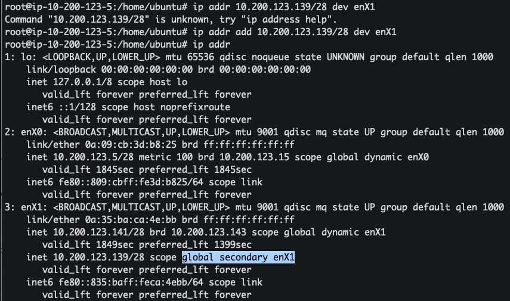

# Networking Fundamentals Bootcamp

Add High Level Repository Structure.

## "Stand-up" updates

2025-06-07

Followed the IP Address management videos while running and testing myself every EC2 instance, see [example](#ip-address-management).

2025-06-06

Template and shell script to create the cloud resources needed for the bootcamp
in AWS. Learned about the useful AWS commands that highlight what failed when
running the Cloud Formation (`aws cloudformation describe-change-set`).
See more in the [Cloud Formation](#cloud-resources-as-code) section blow.

2025-06-04

As I was answering the Readme questions on the diagram from the Livestream-Week
1 I got inspired into making a version 2. You can see the details in the
[Diagram](#diagram) section below.

## Diagram

### [Diagram Readme](journal/week1/diagramming/README.md)

### [Diagram Journal](journal/week1/diagramming/JOURNAL.md)

## Cloud Resources as Code

### [Cloud Resources Readme](journal/week1/projects/env_automation/README.md)

### [Cloud Resources Journal](journal/week1/projects/env_automation/JOURNAL.md)

## IP Address Management

Example:

