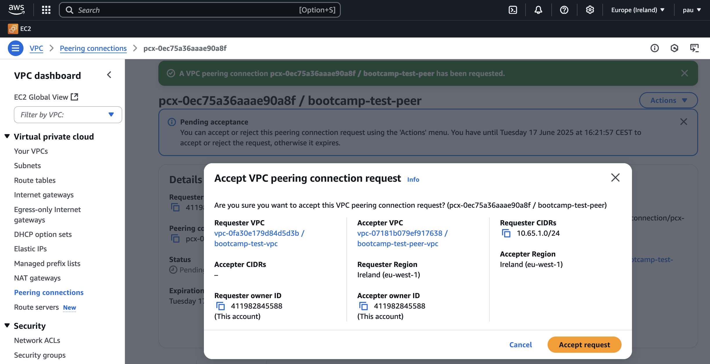
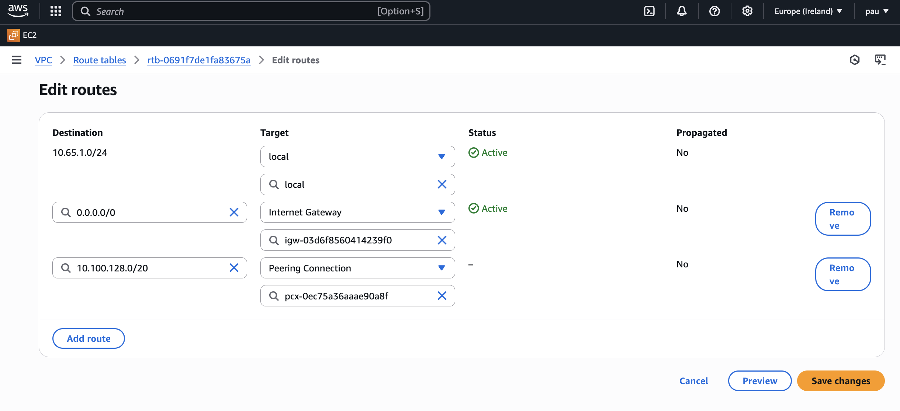
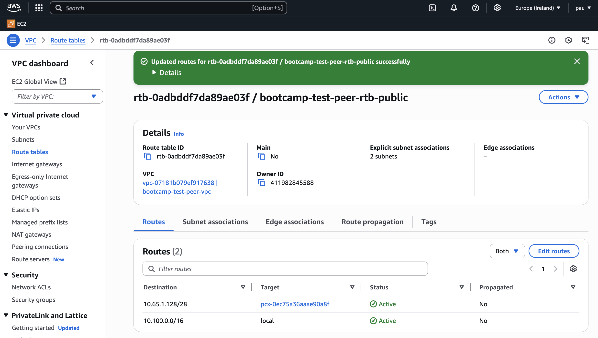
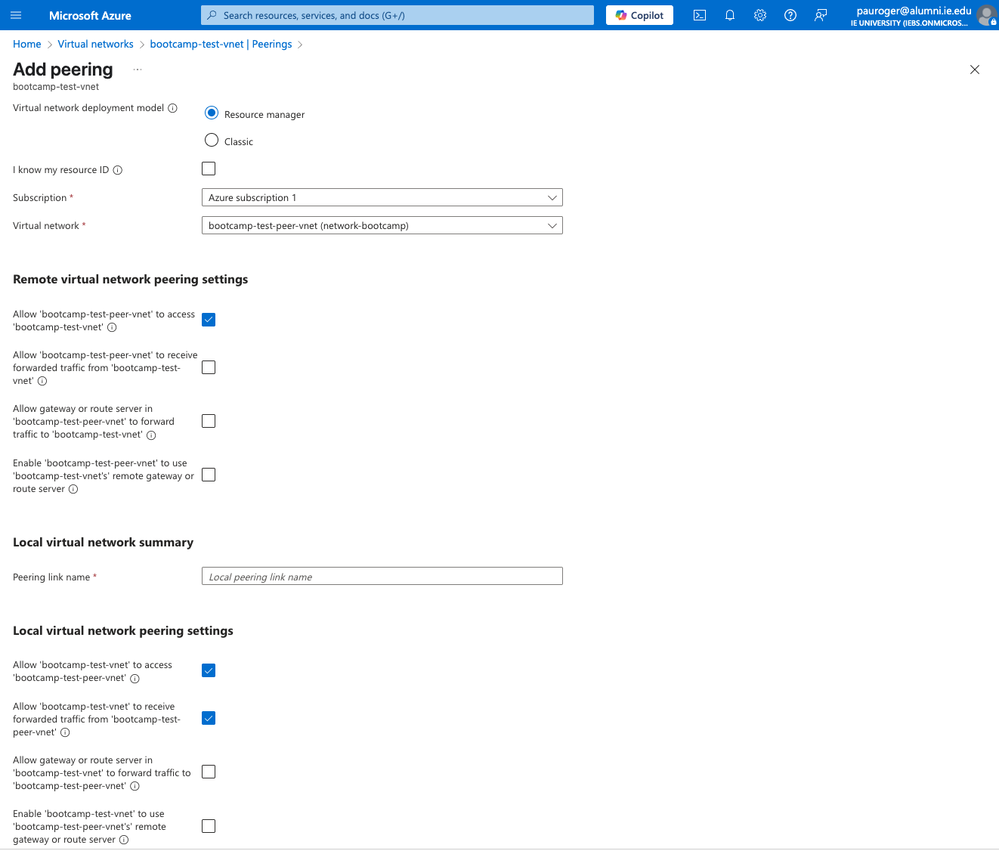
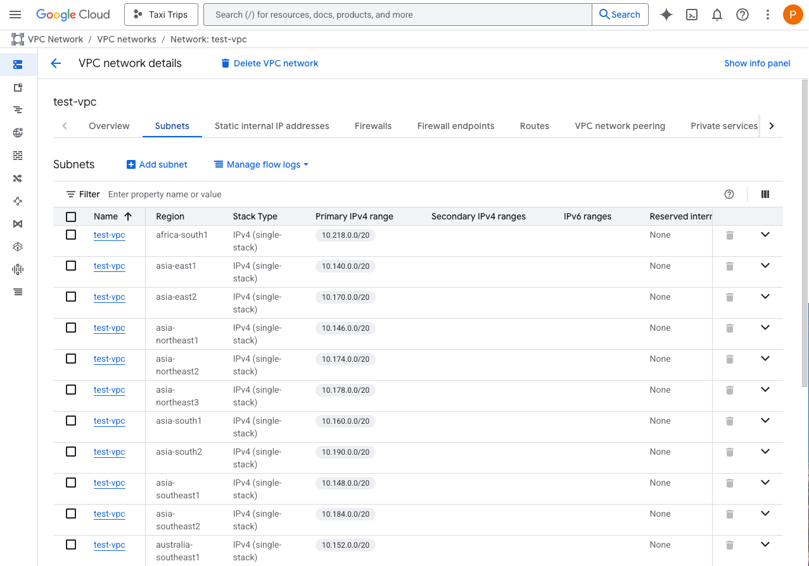

# Journal

## AWS

Created two VPCs: `bootcamp-test-vpc` and `bootcamp-test-peer-vpc`, and
configured them to send traffic to each other via VPC peering.

To enable traffic between the VPCs, you need to update the route tables:

- bootcamp-test-peer-subnet-public1-eu-west-1a (CIDR: 10.100.0.0/20)
- bootcamp-test-subnet-public1-eu-west-1a (CIDR: 10.65.1.0/28)

First, go to the route table associated with the main VPC (non-peer), and add a route pointing to the peer VPC.

Next, configure the peer VPC to allow return traffic to the main VPC.

## Azure

Creating the two virtual networks (VNets) in Azure is very similar to AWS. The
main difference is that peering is mutual by default—you only need to configure
it once if you check the option:

>Allow 'bootcamp-test-vnet' to access 'bootcamp-test-peer-vnet'

## GCP

The key difference in Google Cloud is that VPCs are global, and subnets are
defined per region. For example:

Also, firewall rules apply at the VPC level, not the subnet level.
