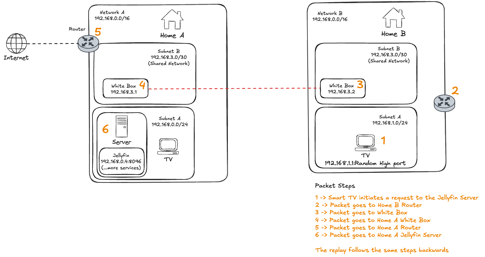

# Media Server Architecture

Private Media Streaming Service

## Initial Diagram

Diagram made as I followed the Week 1 livestream.

[Excalidraw Diagram](https://excalidraw.com/#json=JD-dzjguybS0y7r67-hdY,VUHvR3PqV7_Haif2PSCTxw)

## Improved Diagram

My learnings to get to the improved diagram: [Journal](journal/week1/diagramming/JOURNAL.md)

[Excalidraw Diagram](https://excalidraw.com/#json=pgInz5qYtETm5hVGILXfO,atw5uyt66JS0r8tIrEh--w)

## Questions to Answer

- Explain your uses-case and rational.

**Goal**: Let Home B stream media that lives on Home A’s server, without relying on the public Internet.

- What are the pros and cons of different design descisions. Defend your design choices.

  - Unique /24 per home (10.42.10.0/24, 10.42.20.0/24).
    - Con: “Wastes” addresses for tiny homes.
  - A dedicated /28 transit (10.42.99.0/28) carried on a dual-link LACP bond = no single-cable failure.
  - Each home runs an HA edge pair with VRRP so a router reboot or hardware failure is transparent to the TVs.
  - Dual-link LACP: 2× bandwidth + Single logical interface.
    - Con: Needs switches/NICs that speak LACP. Debugging can be trickier than a single cable

- What would be your recovery plan for this design? What resiliency could you add?

  - Edge-Pi dies
    - Current: VRRP fails over automatically; Jellyfin keeps streaming.
    - Improvements: We could add alerts or a Hard Drive with the same image.
  - One LACP cable dies
    - Current: Bandwidth halves.
    - Improvements: Add a third cable.

- What would this plan look like at scale if you extended it to an entire block instead of just to Home B?

  - Dual-link between houses is probably not scaling to a full block, we could
    build a hub-and-spoke: central block core switch/router in a basement; each
    home LACPs to core. This would Decouple homes from each other (no
    dependency on neighbour’s uptime). It also: Scales linearly, Centralises
    upgrades — want 2.5 Gb Ethernet? Just upgrade the switch, Simplifies routing
    + ACLs — one config file, not N, and Lets you offer more services — mesh
    storage, backups, DNS, etc.
  - We could also update the current Static + VRRP setup to OSPF.
    - Static routing: Each HA edge is manually told: "To reach 10.42.10.0/24, go
      via this next-hop." -> Error prone.
    - OSPF (Open Shortest Path First): Dynamic routing protocol. Each router
      shares what networks it knows about. If a route goes down, OSPF reroutes
      automatically. No need to update static routes manually. Plug a new home
      in → it advertises its /24 automatically.
  - Security: ACLs to VLANs + central firewall
    - ACLs (Access Control Lists): Each HA edge has a local firewall: “Only
      allow TCP 8096, block everything else.” -> Works, but you have to copy
      configs across devices manually.
    - VLAN per home: Each home gets its own isolated Layer 2 network (e.g., VLAN
      10, 20, 30). They can’t see each other by default. -> strong network
      separation.
    - Central firewall: One device (in the basement/core) handles all inter-home
      traffic filtering — with clean global rules like: “Only allow Jellyfin port 8096
      from B to A”

    ACLs are like locks on your front door.
    VLANs + a central firewall give you hallways with card access — you control not just who enters a home, but who walks between them.

- What would you do to resolve overlapping networking conflicts?

Unique /24 per home (10.42.10.0/24, 10.42.20.0/24).
See [JOURNAL.md](journal/week1/diagramming/JOURNAL.md) for details.

- What have you done to security to harden this design?

  - Authentication: strong passwords or SSO via Keycloak.
  - Media server lives in its own VLAN/zone on Home A.
  - Backups: Daily rsync to Home B + cloud snapshot weekly.
