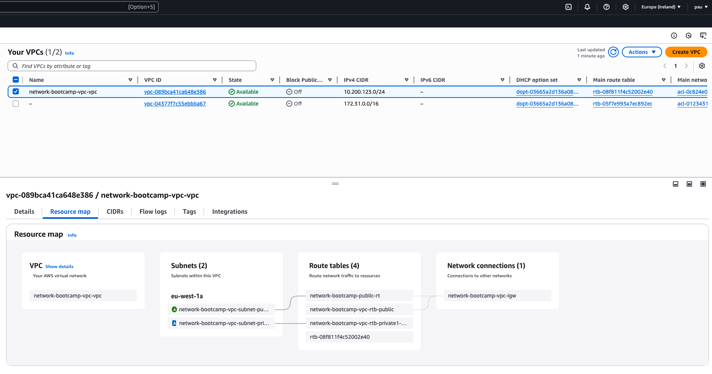
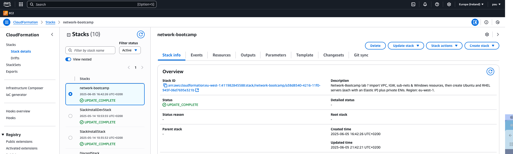

# Infrastructure as Code

## Settings

These are the VPC Settings we observed Tim setup for our cloud enviroment in AWS:

- VPC
  - Name: network-bootcamp
  - IPv4 CIDR block: 10.200.123.0/24
  - No Ipv6
  - 1 availability zone.
  - 1 public subnet.
  - 1 private subnet.
  - No NAT gateways.
  - No VPC endpoints.
  - Enable DNS hostnames and resolution.

- 3 EC2 instances:
  - For all instances:
    - Key-pair: network-bootcamp-key-pem.pem 
    - VPC network-bootcamp public.
    - Auto-assign public IP.
    - Security group: "allow-login". Add a rule: Type SSH with Source: My IP.
    - Source Type: My IP
    - Add a security group role: All Traffic with source traffic custom and CIDR block 10.200.123.0/24.
  - Instance 1 -> Windows:
    - Name: windows-ec2
    - Server 2025 Base.
    - Type: t3.large.
    - Storage volume: 1 with 30 GB
  - Instance 2 -> Ubuntu
    - Name: ubuntu-ec2
    - Server: 24.04 LTS (HVM), SSD Volume Type.
    - Type: t2.medium.
    - 16 GB.
  - Instance 3 -> RedHat
    - Name: redhat-ec2
    - Server: Default.
    - Type: t2.medium.
    - 16 GB.

- 3 Network interfaces:
  - For all Network interfaces:
    - subnet: network-bootcamp-subnet-private
    - Use the same security group from before called 'allow-login'
  - Network 1: 
    - windows-server-private.
    - Attach it to the windows-ec2 instance.
  - Network 2:
    - ubuntu-server-private.
    - Attach it to the ubuntu-ec2 instance.
  - Network 3:
    - redhat-server-private.
    - Attach it to the redhat-ec2 instance.

Notes:

- Region: eu-west-1 for everything.
- Make sure we keep the same public IP (Elastic IP setup), when we reboot the
  instances. Associate the Elastic IP to every instance created.

## Generated and Review CFN Template & Deploy Script

I had already created some of the resources through the UI as I was watching
Tim's video, which added a bit of overhead as I had to migrate those to the code
as well as add the code to create the missing resources. This is why I created 2
templates, and there is a commented out section on the deploy script, which
should be uncommented only for the first run.

Watching the instructor's videos, I noted the VPC Settings, provided this to LLM
to produce the CFN template to automate the provision of the VPC infrastructure.

- LLM was not very useful in getting the template working, but it guided me on
  how to debug. E.G.:

  - Delete command to be able to redeploy clean:

  ```sh
  aws cloudformation delete-stack \
    --stack-name network-bootcamp \
    --region eu-west-1
  aws cloudformation wait stack-delete-complete \
    --stack-name network-bootcamp \
    --region eu-west-1
  ```

  - Show the change‐set failure reason

  ```sh
  aws cloudformation describe-change-set \
    --change-set-name import-$(date +%s) \
    --stack-name network-bootcamp \
    --region eu-west-1 \
    --query "StatusReason" \
    --output text

  aws cloudformation describe-change-set \
    --stack-name network-bootcamp \
    --change-set-name update-1749135313 \
    --region eu-west-1 \
    --query "StatusReason" \
    --output text
    ```

## Visulization in Infrastructure Composer

Visualisation of the cloud_formation_template via Infrastructure Composer VSCode
extension.


## Deployed Resource to AWS

This is the resource map of the VPC deployed with CFN.



