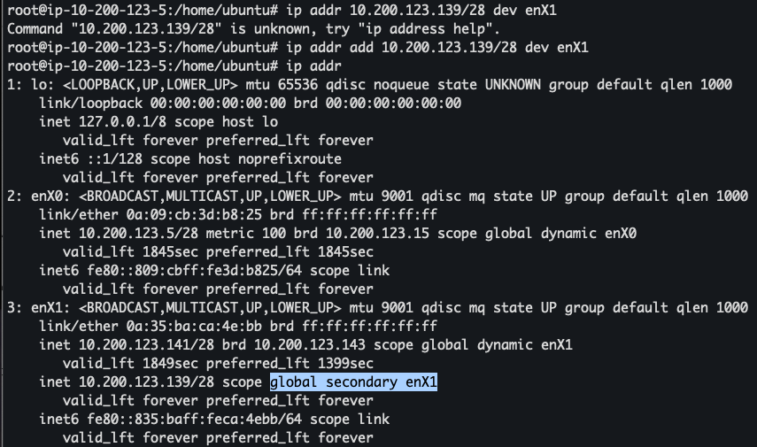
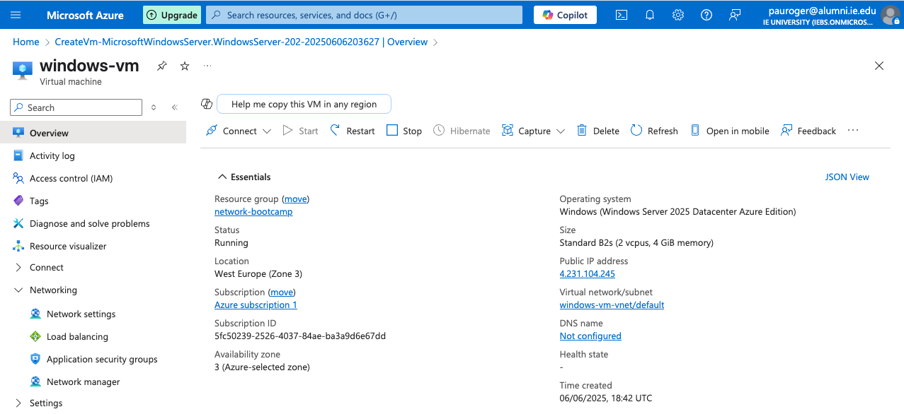
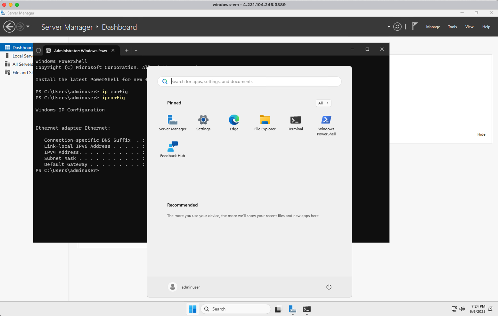

# Journal

1) Followed the IP Address Management videos while running and testing myself every
EC2 instance, Ubuntu example:



2) Created an Azure Windows VM and added its template in:

```sh
projects/week1/ip-address-management/templates/vm/
```



The image I initially selected in my region: `Windows (Windows Server 2025
Datacenter Azure Edition`), had a Windows UI:


