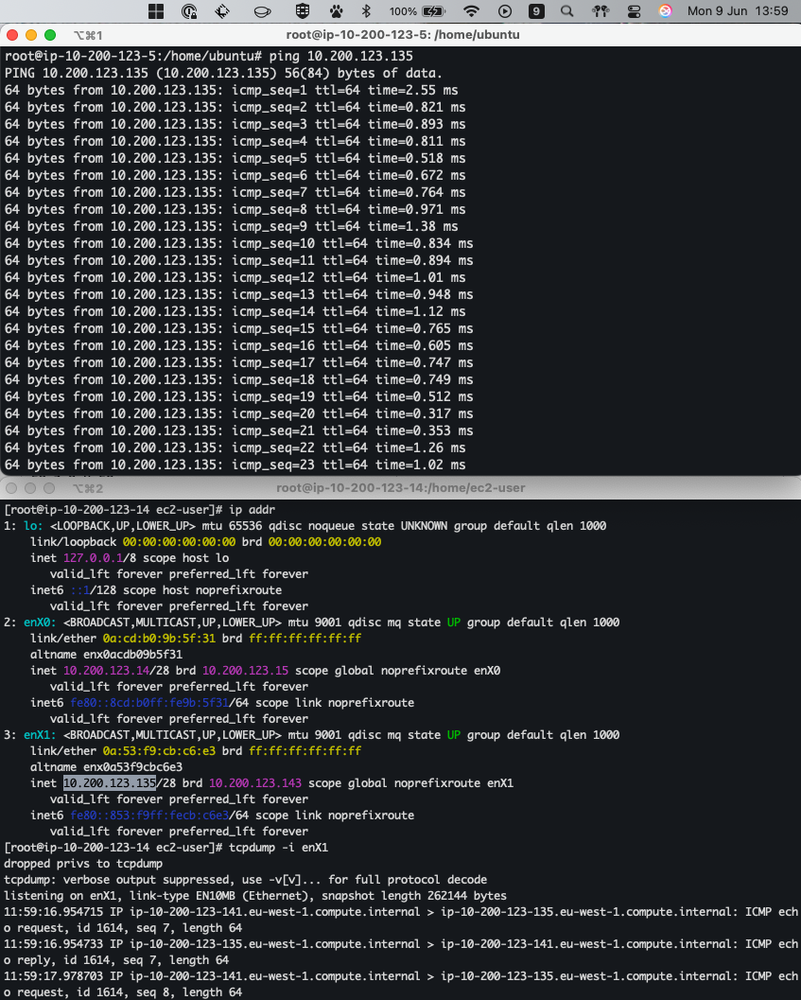

# Journal

## Communicate between the Ubuntu and RedHat box

In the top terminal, I'm logged into the **Ubuntu EC2 instance**. I initiate a
`ping` to the IP address `10.200.123.135`, which is the IP bound to interface
`enX1` on the **Red Hat EC2 instance** (shown in the bottom terminal).

In the bottom terminal, I confirm the IP address assignment via ip addr, which
shows `10.200.123.135/32` on interface `enX1`. I then run:

```sh
tcpdump -i enX1
```

This captures ICMP traffic, and I can verify that the Red Hat instance is
successfully **receiving the echo requests** from the Ubuntu machine. The
captured packets confirm that network connectivity exists between the two
instances over the `enX1` interface.



## Wget vs Curl

The main difference between the 2 commands is that `curl -I` only inspects
headers, while `wget` inspects the full content. Also, by default. `curl -I`
does not redirect (302 → 200), while `wget` does.

`curl` example:

```sh
root@ip-10-200-123-5:/home/ubuntu# curl -I https://vilaweb.cat
HTTP/2 302
content-length: 0
location: https://www.vilaweb.cat/
date: Mon, 09 Jun 2025 11:38:11 GMT
server: Varnish
x-varnish: 716104763
x-cache: Miss from cloudfront
via: 1.1 3dda624923fc4f3e441715eb875fc762.cloudfront.net (CloudFront)
x-amz-cf-pop: DUB56-P3
x-amz-cf-id: ne1drVbeWSW9AIjtLaaevno_cultvx1ZEbyH3wNQ6cTOGyznkWvU1Q==
```

`wget` example:

```sh
root@ip-10-200-123-5:/home/ubuntu# wget https://vilaweb.cat
--2025-06-09 11:39:32--  https://vilaweb.cat/
Resolving vilaweb.cat (vilaweb.cat)... 3.165.232.68, 3.165.232.48, 3.165.232.55, ...
Connecting to vilaweb.cat (vilaweb.cat)|3.165.232.68|:443... connected.
HTTP request sent, awaiting response... 302 Found
Location: https://www.vilaweb.cat/ [following]
--2025-06-09 11:39:32--  https://www.vilaweb.cat/
Resolving www.vilaweb.cat (www.vilaweb.cat)... 3.162.140.70, 3.162.140.105, 3.162.140.97, ...
Connecting to www.vilaweb.cat (www.vilaweb.cat)|3.162.140.70|:443... connected.
HTTP request sent, awaiting response... 200 OK
Length: 677182 (661K) [text/html]
Saving to: ‘index.html’

index.html                 100%[=====================================>] 661.31K  --.-KB/s    in 0.006s

2025-06-09 11:39:32 (101 MB/s) - ‘index.html’ saved [677182/677182]
```

PS. `vilaweb.cat` is a local online newspaper.
