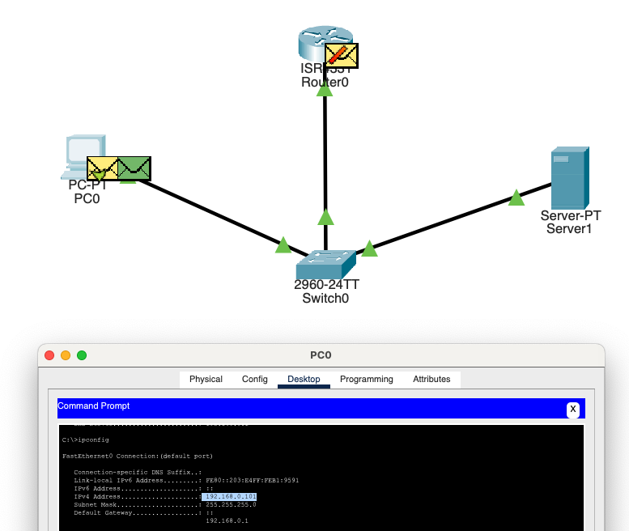

# State of the Network

Followed along Tip's Tutorial:



1) Describe the diagram.

Using Cisco Packet Tracer, we've made a Diagram .

We have connected via ethernet the PC and server to the switch using
FastEthernet and GigbEthernet between the Router and the Switch.

On the Router:

- IPv4 Addess to: 192.168.0.1
- SubnetMask: 255.255.255.0

On the server:

- We have set the Default Gateway and DNS Server to 192.168.0.2 (Gave a
  different static IP so it doesn’t clash with the router.)
- As well as the IPv4 Addess to the same: 192.168.0.2
- And SubnetMask: 255.255.255.0

Next, On the PC we opened a command prompt and asked for: `ipconfig /renew`.

```sh
                 ┌──────────┐  Gi0/0
                 │ Router0  │  192.168.0.1/24   (default-gateway, DHCP)
                 │  ISR4331 │
                 └────┬─────┘
                      │
                      │ Gigabit-Ethernet
                      ▼
              ┌────────────────┐
              │ Switch0        │  Cisco Catalyst 2960-24TT
              └─┬────────┬─────┘
     Fa0/1 ▲   │        │   ▲ Fa0/2
           │   │        │   │
           │   │        │   │
         PC0   │        │  Server1
   DHCP client │        │  Static-IP ( 192.168.0.2/24 )
               │        │
   ────────────┘        └───────────────────────────────

```

2) Packet flow in order for the PC to get it's IP Address.

- DHCP DISCOVER – PC has no IP yet (0.0.0.0), so both IP and MAC destination are
  broadcast (FF-FF-FF-FF-FF-FF).
- Switch → all active ports - Switch replicates the L2 broadcast to Router and Server.
  - Router silently discards - Router is not running a DHCP service (and isn’t a
    helper/relay) so it drops the packet.
- DHCP OFFER 255.255.255.255 - Server1’s DHCP daemon picks an unused lease
  (192.168.0.101) and replies.
- DHCP REQUEST - PC formally asks “I want the offer from that server.”
- DHCP ACK - Server confirms—the lease is now official.
- Configuration applied - PC writes the IP (192.168.0.101), mask, default-gw
  192.168.0.1 to its NIC, ARPs for the gateway, and normal unicast switching
  takes over.
