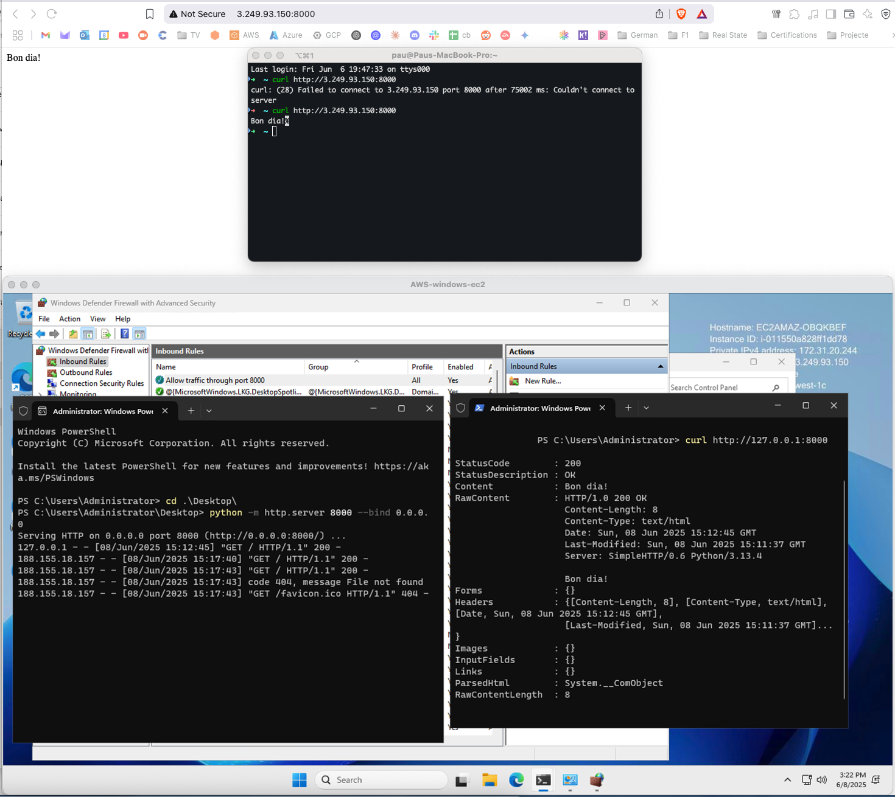

# Journal

## Start Server

```sh
cd projects/windows-firewall-rules
python -m http.server 8000
```

Output:

```sh
PS C:\Users\adminuser> python -m http.server 8000
Serving HTTP on :: port 8000 (http://[::]:8000/) ...
::1 - - [08/Jun/2025 14:47:38] "GET / HTTP/1.1" 200 -
::ffff:127.0.0.1 - - [08/Jun/2025 14:48:02] "GET / HTTP/1.1" 200 -
```

## Curl Server

By default, the Windows Firewall blocks all incoming traffic that doesn't match
an inbound rule. We added an inbound rule to allow traffic on port 8000.

To test connectivity, we used curl from our local machine and were able to reach
the server.

In addition to configuring the Windows Firewall, we also had to open port 8000
in the AWS Security Group to allow external access.

```sh
curl http://127.0.0.1:8000
```

Output Within my Windows EC2 Instance:

```sh
PS C:\Users\Administrator> curl http://127.0.0.1:8000                                                                   

StatusCode        : 200
StatusDescription : OK
Content           : Bon dia!
RawContent        : HTTP/1.0 200 OK
                    Content-Length: 8
                    Content-Type: text/html
                    Date: Sun, 08 Jun 2025 15:12:45 GMT
                    Last-Modified: Sun, 08 Jun 2025 15:11:37 GMT
                    Server: SimpleHTTP/0.6 Python/3.13.4

                    Bon dia!
Forms             : {}
Headers           : {[Content-Length, 8], [Content-Type, text/html], [Date, Sun, 08 Jun 2025 15:12:45 GMT],
                    [Last-Modified, Sun, 08 Jun 2025 15:11:37 GMT]...}
Images            : {}
InputFields       : {}
Links             : {}
ParsedHtml        : System.__ComObject
RawContentLength  : 8
```

Ouptput from my local machine (Before and after allowing the traffic from port
8000 in my remote Box):

```sh
➜  ~ curl http://3.249.93.150:8000
curl: (28) Failed to connect to 3.249.93.150 port 8000 after 75002 ms: Couldn't connect to server
➜  ~ curl http://3.249.93.150:8000
Bon dia!%
```

PS. 'Bon dia' means 'Good Day' in Catalan.

## Proof of Work


