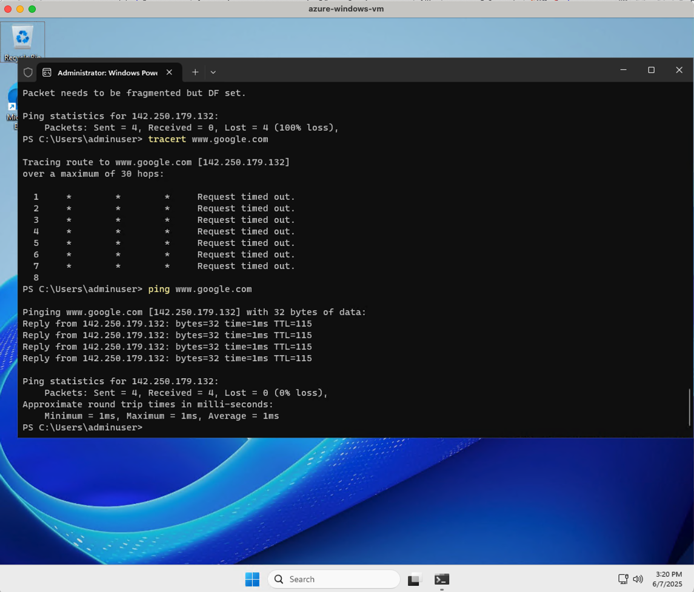

# Journal

## Developer Enviroment



I am using the Azure VM whtat we set up in the 
[IP Management project](../ip_address_management/JOURNAL.md).

## IPConfig

```sh
PS C:\Users\adminuser> ipconfig

Windows IP Configuration


Ethernet adapter Ethernet:

   Connection-specific DNS Suffix  . : rvdgfzub0lyejptsxespcg2gld.ax.internal.cloudapp.net
   Link-local IPv6 Address . . . . . : fe80::e885:4f9:97f6:9b3a%5
   IPv4 Address. . . . . . . . . . . : 10.0.0.4
   Subnet Mask . . . . . . . . . . . : 255.255.255.0
   Default Gateway . . . . . . . . . : 10.0.0.1
```

Command used to do IP configurations in Windows, we see a list of our adaptors
and IP addresses.

- Ethernet adapter Ethernet: virtual Ethernet network interface (i.e., wired
  connection or virtual NIC in a VM or cloud environment).
- Connection-specific DNS Suffix: Automatically assigned by Azure.
- IPv4 Address: private IP range (10.0.0.0/8).
- Subnet Mask: This tells the computer which IP addresses are in its local
network.
- Gateway: This is the router IP the system uses to communicate outside the
  local subnet (e.g., to the internet or other networks).

## Ping

```sh
PS C:\Users\adminuser> ping -t www.youtube.com

Pinging youtube-ui.l.google.com [142.251.36.14] with 32 bytes of data:
Reply from 142.251.36.14: bytes=32 time=1ms TTL=115
Reply from 142.251.36.14: bytes=32 time=1ms TTL=115
Reply from 142.251.36.14: bytes=32 time=1ms TTL=115
Reply from 142.251.36.14: bytes=32 time=1ms TTL=115
Reply from 142.251.36.14: bytes=32 time=1ms TTL=115
Reply from 142.251.36.14: bytes=32 time=1ms TTL=115
Reply from 142.251.36.14: bytes=32 time=1ms TTL=115
Reply from 142.251.36.14: bytes=32 time=1ms TTL=115
Reply from 142.251.36.14: bytes=32 time=1ms TTL=115

Ping statistics for 142.251.36.14:
    Packets: Sent = 9, Received = 9, Lost = 0 (0% loss),
Approximate round trip times in milli-seconds:
    Minimum = 1ms, Maximum = 1ms, Average = 1ms
```

The ping command is a network diagnostic tool used to test connectivity between
your computer and another device (like a website or IP address). It sends ICMP
echo requests and waits for echo replies, measuring:

- If the destination is reachable.
- How long it takes (round-trip time).
- If any packets are lost.

## Trace Route

```sh
PS C:\Users\adminuser> tracert www.chess.com

Tracing route to www.chess.com [104.18.139.67]
over a maximum of 30 hops:

  1     *        *        *     Request timed out.
  2     *        *        *     Request timed out.
  3     *        *        *     Request timed out.
  4     *        *        *     Request timed out.
  5     *        *        *     Request timed out.
  6     *        *        *     Request timed out.
  7     *        *        *     Request timed out.
  8     *        *        *     Request timed out.
```

tracert (trace route) shows the path your packets take to a destination by
sending packets with increasing TTL (Time to Live) values. Each router along the
path should reply with an ICMP "Time Exceeded" message — allowing you to see
each hop.

On the example: no reply was received from any hop. Likely cause:

- Azure blocks inbound ICMP: Azure Network Security Groups (NSGs) and default
  router/firewall settings often drop or ignore ICMP Time Exceeded messages,
  which tracert relies on.

## Netstat

```sh
PS C:\Users\adminuser> netstat

Active Connections

  Proto  Local Address          Foreign Address        State
  TCP    10.0.0.4:3389          xdsl-188-155-18-157:49884  ESTABLISHED
  TCP    10.0.0.4:49675         168.63.129.16:32526    ESTABLISHED
  TCP    10.0.0.4:49684         168.63.129.16:http     ESTABLISHED
  TCP    10.0.0.4:49692         168.63.129.16:32526    ESTABLISHED
  TCP    10.0.0.4:49738         172.211.123.249:https  ESTABLISHED
  TCP    10.0.0.4:49793         172.211.123.249:https  ESTABLISHED
  TCP    10.0.0.4:50954         168.63.129.16:http     ESTABLISHED
  TCP    10.0.0.4:50973         150.171.28.11:https    TIME_WAIT
  TCP    10.0.0.4:50974         150.171.28.11:http     TIME_WAIT
  TCP    10.0.0.4:50975         a-0003:https           FIN_WAIT_2
  TCP    10.0.0.4:50976         ams15s42-in-f14:https  TIME_WAIT
  TCP    10.0.0.4:50977         13.107.42.16:https     TIME_WAIT
  TCP    10.0.0.4:50979         150.171.28.11:https    TIME_WAIT
  TCP    10.0.0.4:50980         a-0003:https           TIME_WAIT
  TCP    10.0.0.4:50982         ams15s42-in-f1:https   TIME_WAIT
  TCP    10.0.0.4:50984         150.171.28.11:https    TIME_WAIT
  TCP    10.0.0.4:50985         13.107.42.16:https     TIME_WAIT
```

`netstat` (network statistics): active network connections, listening ports, and
other low-level network stats.

On the example we are seeing active TCP connections from the VM (10.0.0.4) to
various remote servers.

## Route

```sh
PS C:\Users\adminuser> route print
===========================================================================
Interface List
  5...00 0d 3a 44 4d aa ......Microsoft Hyper-V Network Adapter
  1...........................Software Loopback Interface 1
===========================================================================

IPv4 Route Table
===========================================================================
Active Routes:
Network Destination        Netmask          Gateway       Interface  Metric
          0.0.0.0          0.0.0.0         10.0.0.1         10.0.0.4     11
         10.0.0.0    255.255.255.0         On-link          10.0.0.4    266
         10.0.0.4  255.255.255.255         On-link          10.0.0.4    266
       10.0.0.255  255.255.255.255         On-link          10.0.0.4    266
        127.0.0.0        255.0.0.0         On-link         127.0.0.1    331
        127.0.0.1  255.255.255.255         On-link         127.0.0.1    331
  127.255.255.255  255.255.255.255         On-link         127.0.0.1    331
    168.63.129.16  255.255.255.255         10.0.0.1         10.0.0.4     11
  169.254.169.254  255.255.255.255         10.0.0.1         10.0.0.4     11
        224.0.0.0        240.0.0.0         On-link         127.0.0.1    331
        224.0.0.0        240.0.0.0         On-link          10.0.0.4    266
  255.255.255.255  255.255.255.255         On-link         127.0.0.1    331
  255.255.255.255  255.255.255.255         On-link          10.0.0.4    266
===========================================================================
```

The `route` commands shows Network interfaces available on the system. This is
useful for understanding how the machine decides where to send outbound
traffic.

With the print argument we can see the all active IPv4 routes.
