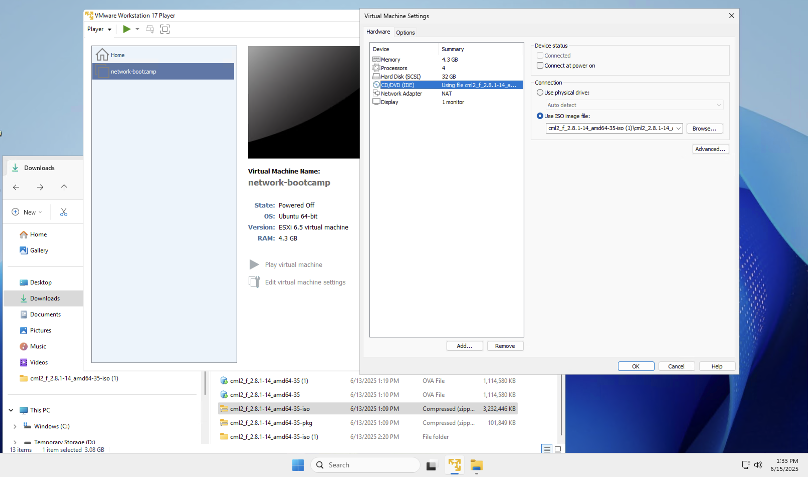

# Journal

Followed Tim's workshop on how to operate and use Cisco Modeling Labs (CML). Although I wasn’t able to fully reproduce the setup myself, I still found the session insightful—particularly the way CML uses the host computer as the equivalent of the "open internet" for the virtual machine network.

Here’s how far I got:

- Successfully downloaded the software and ISO image.
- Installed VMware and configured the virtual machine settings accordingly.



However, upon starting the VM, I encountered the following error:

```sh
VMware Player and Hyper-V are not compatible. Remove the Hyper-V role from the
system before running VMware Player
```

I attempted to troubleshoot this with ChatGPT, but eventually paused my efforts due to time constraints and unresolved compatibility issues.
