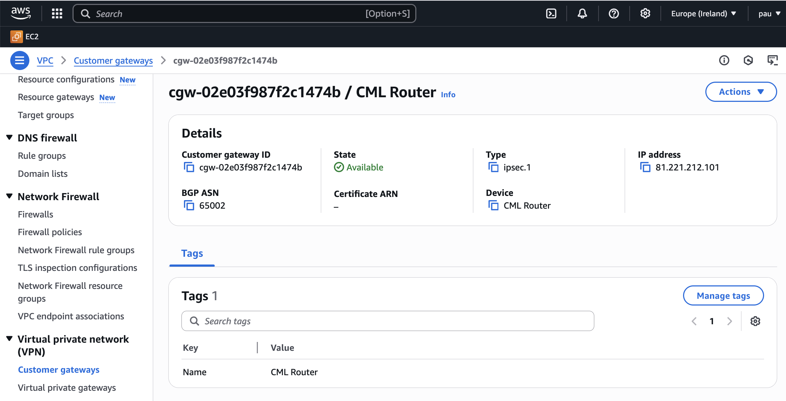
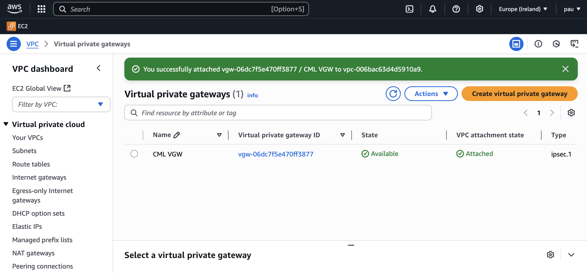
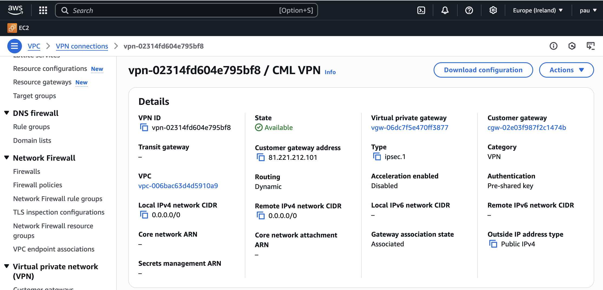

# Journal

## AWS VPN Connection to CML Router

We set up a Customer Gateway VPN on AWS:



Next, we created a VPN:



And finally, a VPN Connection:



We attached the VPN to the `network-bootcamp-vpc` created in Week 1 and
downloaded the router configuration file provided by AWS for Cisco devices.

On that config we have made the following configuration adjustments:

```sh
!  tunnel source 81.221.212.101
  tunnel source Gig1
```

AWS suggests using the public IP as the tunnel source, but our CML router
doesn’t have knowledge of its public IP. Instead, we updated it to use the Gig1
CML Router.

AWS provides redundancy via two tunnels, but this lab uses only one router—so we
configured just one tunnel.

We also updated the IPsec encryption group:

```sh
!  group 2
  group 14
```

Group 2 (the default) uses outdated algorithms. Most modern routers, including
the one in CML, no longer accept it—so we switched to group 14, which is more
secure and widely supported.

We commented out the default route advertisement, since our CML lab environment
doesn’t have access to the open internet:

```sh
!    network 0.0.0.0
```

Finally, we also had to enable 'Propagation' within the Routing public and
private tables from the Subnets of AWS.
