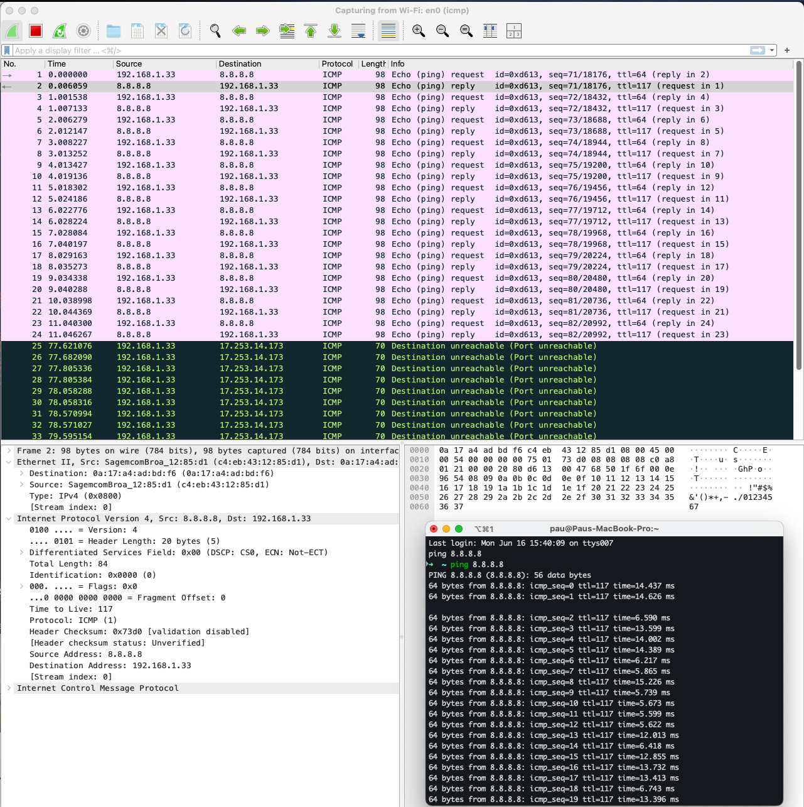

# Journal

Wireshark is a powerful network protocol analyzer. A tool used to capture and
inspect packets of data traveling across a network in real time. Wireshark is
used to:

- Analyze traffic between devices.
- Troubleshoot connectivity or configuration issues in the network lab.
- Inspect protocols at each layer of the OSI model (e.g., check DHCP offers, TCP
  handshakes, etc.).
- Validate lab setups by confirming that traffic flows as expected (e.g., pings,
  routing updates, VPN tunnels).

To be able to follow along, since I was not able to install CML, I pinged from
my local machine instead and followed the packets along within Wiresharkga
.
Example of ICMP traffic while pinging 8.8.8.8

PS. ICMP (Internet Control Message Protocol) is a network layer protocol used
for sending error messages and operational information between devices on a
network.
