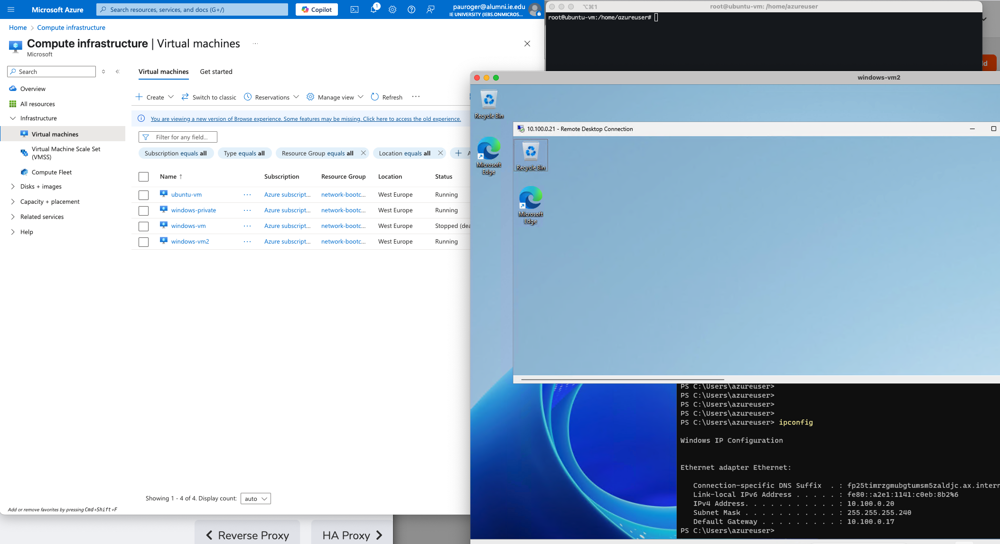
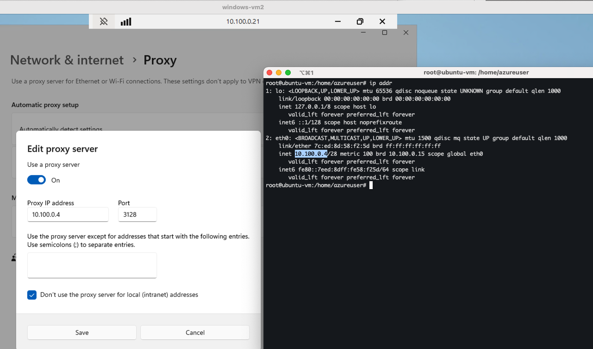
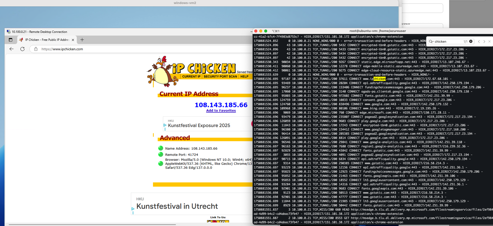

# Journal

I had to recreate the Windows VM (again) because it was originally deployed in
the wrong VPC. To preserve the operating system, configurations, and installed
applications, I created a snapshot of its OS disk. From that snapshot, I
generated a managed disk, which I then used to deploy a new VM in the correct
VPC and private subnet. This setup allows the Windows VM to communicate
privately with the Ubuntu VM.

To further test internal networking, I created an additional Windows VM, this
time also within the same private subnet. The purpose of this second Windows VM
was to connect to it via Remote Desktop (RDP) from the first Windows VM,
verifying that internal communication between machines in the same subnet works
as expected.

I successfully connected to the second Windows VM from the first one using RDP.
For completeness, I captured a screenshot that includes the VM overview in Azure
and the Ubuntu VM — the "proxy" box — for reference.

Within the second (private) Windows VM, I configured the system to route its
internet traffic through the Squid proxy running on the Ubuntu machine. This
involved setting the Ubuntu VM’s private IP address and the Squid proxy port in
the Windows network settings.

After applying the proxy settings, the private Windows VM was able to access the
internet successfully — despite having no public IP address. All outbound
traffic was routed through the Squid proxy on the Ubuntu VM, validating that the
proxy setup works correctly for enabling outbound internet access from a private
subnet.

