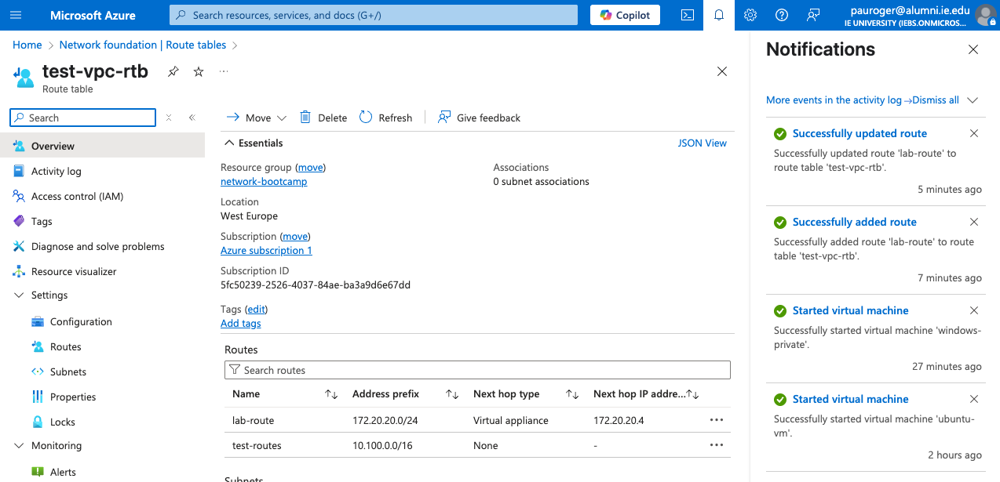
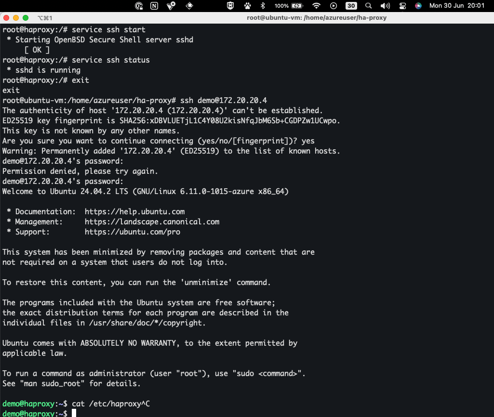

# Journal

## HAProxy

**HAProxy** stands for High Availability Proxy.

It is a software-based load balancer and reverse proxy commonly used to
distribute network traffic across multiple backend servers.

### Why is HAProxy used?

#### Load Balancing

Distributes incoming traffic across multiple backend servers to ensure:

- No single server gets overwhelmed.
- Better performance and higher concurrency.

#### High Availability (HA)

- If one backend server fails, HAProxy automatically reroutes traffic to healthy
  servers.
- This ensures service uptime and reliability.

#### Reverse Proxy

- Acts as an intermediary between clients and backend servers.
- Hides the internal architecture from external users, providing an abstraction
  layer.

#### Security Layer

- Filters malicious or unwanted traffic.
- Can handle SSL/TLS termination — clients connect securely to HAProxy, which
  then forwards traffic to backend servers.

#### Session Persistence (Sticky Sessions)

- Optionally ensures a user remains connected to the same backend server, which
  is useful for session-based applications.

#### Traffic Management

- Supports rate limiting, connection throttling, access control, and traffic
  monitoring.

---

## Lab Journal

### File Transfer to Ubuntu

Copied the HAProxy project files from my local machine to the Ubuntu VM using:

```sh
scp -r -i ~/.ssh/azure-ubuntu-vm-key-pair.pem <ha-proxy-path> azureuser@<public-ip>:/home/azureuser/
```

### Preparing Web Servers

Created folders for `web1` and `web2` with their respective HTML files
containing simple web pages.

### Deploying with Containerlab

Installed Docker and deployed the HAProxy lab topology using:

```sh
containerlab deploy
```

**Deployment output:**

```plaintext
INFO Containerlab started version=0.68.0
INFO Parsing & checking topology file=haproxylab.clab.yaml
INFO Creating docker network name=clab IPv4 subnet=172.20.20.0/24
INFO Pulling docker.io/haproxytech/haproxy-ubuntu:latest
INFO Pulling docker.io/ubuntu/apache2:latest
INFO Creating lab directory /home/azureuser/ha-proxy/clab-basic-haproxylab1
INFO Creating containers: web1, web2, haproxy
INFO Adding SSH config for nodes
╭────────────────────────────────┬───────────────────────────────────┬─────────┬───────────────────╮
│              Name              │             Kind/Image            │  State  │   IPv4/6 Address  │
├────────────────────────────────┼───────────────────────────────────┼─────────┼───────────────────┤
│ clab-basic-haproxylab1-haproxy │ haproxytech/haproxy-ubuntu:latest │ running │ 172.20.20.4       │
│ clab-basic-haproxylab1-web1    │ ubuntu/apache2:latest             │ running │ 172.20.20.2       │
│ clab-basic-haproxylab1-web2    │ ubuntu/apache2:latest             │ running │ 172.20.20.3       │
╰────────────────────────────────┴───────────────────────────────────┴─────────┴───────────────────╯
```

### Routing Configuration

Added a static route on the Windows machine to direct traffic for the container network through the Ubuntu VM:

```sh
route add 172.20.20.0 mask 255.255.255.0 10.100.0.17 IF 2
```

Also configured a User Defined Route (UDR) in the Azure Route Table:



### Verifying Connectivity

SSH into the HAProxy node:

```sh
ssh demo@172.20.20.4
```

**Proof of Work:**



### Testing Web Servers

Validated that HAProxy can reach both backend web servers via HTTP:

```sh
curl http://172.20.20.2
```

Response:

```html
<HTML>
<p>This is Web1</p>
</HTML>
```

Tested the second server:

```sh
curl http://172.20.20.3
```

Response:

```html
<HTML>
<p>This is the second web</p>
</HTML>
```

---

✔️ **Lab complete with full routing, HAProxy deployment, and backend validation.**
