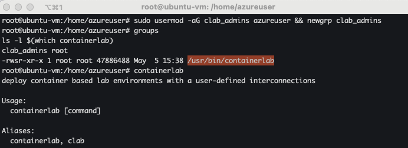

# Journal

## High-Level Overview

A **Load Balancer** is a networking component (hardware or software) that distributes incoming network traffic across multiple backend servers to ensure no single server becomes overwhelmed. It's a key part of high-availability, scalable systems.

Why is it used?

- High Availability: If one server goes down, traffic is routed to healthy ones.
- Scalability: More servers can be added or removed dynamically to handle
  demand.
- Performance Optimization: It reduces latency by directing traffic to the
  closest or least busy server.
- Fault Tolerance: Health checks identify and bypass unresponsive servers.
- Security: Can hide internal server structure and offer basic DDoS protection.

Types of Load Balancing

- Layer 4 (Transport): Balances traffic based on TCP/UDP ports & IPs.
- Layer 7 (Application): Balances based on content (e.g., URL, headers) - HTTP,
  HTTPS
- Global Load Balancer: Routes users based on geography - DNS-based.

**TLS (Transport Layer Security)** is a cryptographic protocol used to secure
data transmitted over a network—primarily across the internet. It ensures that
the connection between two endpoints (like a web browser and a server) is
private, authenticated, and tamper-proof.

## Lab

Installed Container Lab's in an Ubunto box in Azure.

