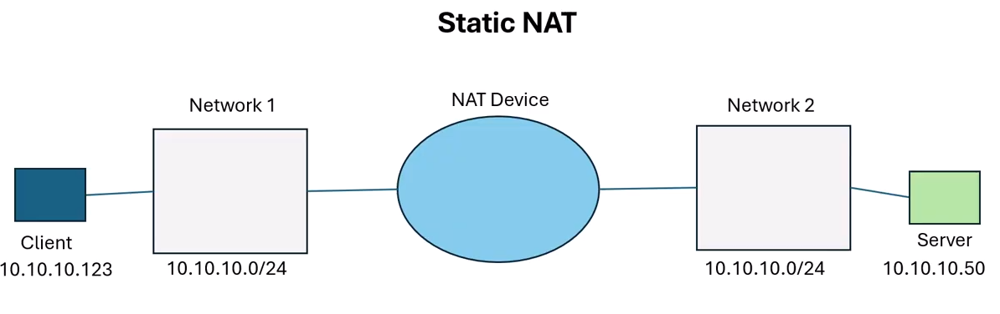
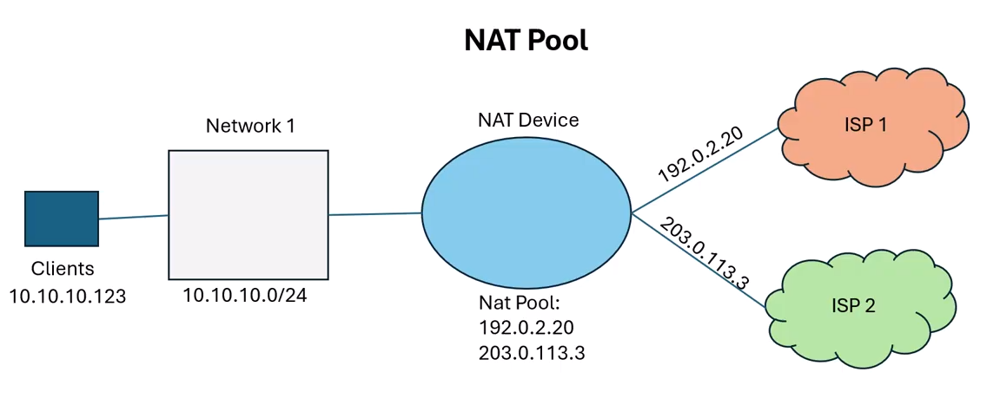
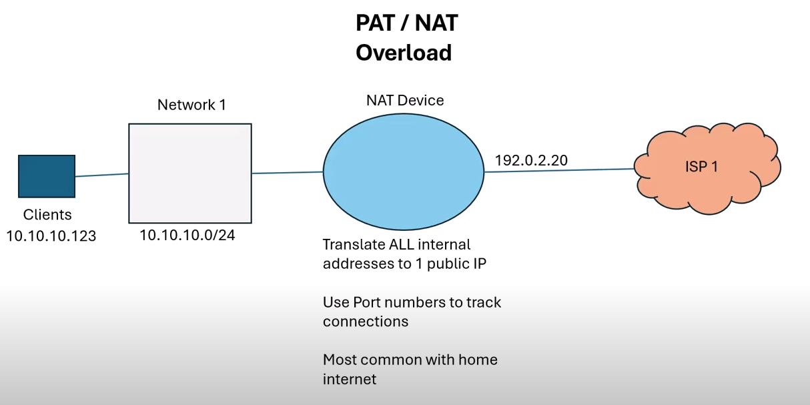

# Journal

**NAT** (Network Address Translation) is a method that lets multiple devices on
a private network share a single public IP address. Why NAT is used:

- Conserves public IP addresses
- Adds a layer of security by hiding internal IPs
- Allows internet access for devices with private IPs

**Static NAT** maps one private IP address to one public IP address permanently.
Used when a device needs a consistent public identity.

Key Features:

- One-to-one mapping (fixed)
- Useful for servers that need to be accessible from outside (e.g., web server,
  VPN gateway)
- The mapping does not change

A **NAT Pool** is a range of public IP addresses used to dynamically translate
multiple private IPs to multiple public IPs. It provides a set of public IPs
that private devices can use temporarily when connecting to external networks.

Key Features:

- Many-to-many mapping (within the pool)
- Used for Dynamic NAT
- Helps when many private hosts need internet access, and you have several
  public IPs available

**PAT (Port Address Translation)**—also called NAT Overload—maps many private
IPs to a single public IP, using different port numbers to keep the connections
unique. PAT lets many devices share one public IP by assigning each session a
unique port number.

Key Features:

- Many-to-one mapping
- Saves public IPs (only one is needed)
- Most common form of NAT (used in homes and small offices)

