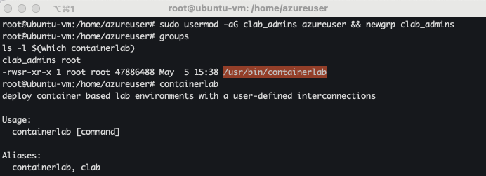
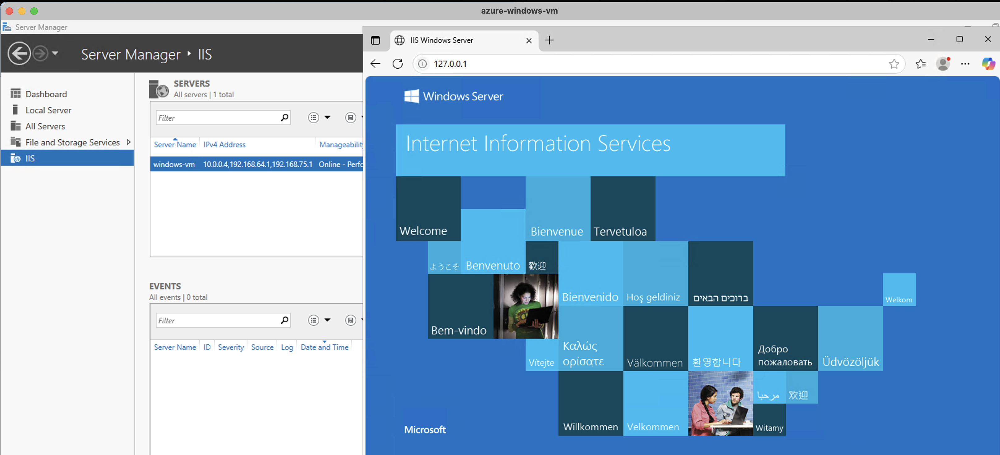
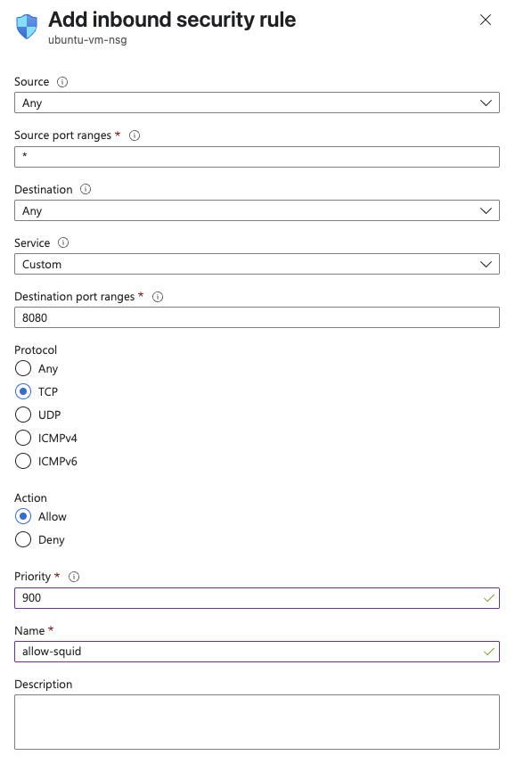

# Journal

## Reverse Proxy Lab

Installed Container Lab's in an Ubuntu box in Azure.



**Squid** is a high-performance caching and forwarding HTTP proxy server. It
supports a wide range of protocols including HTTP, HTTPS, FTP, and more.

- Squid acts on behalf of internal users to access the internet. Benefits:

  - Content caching (faster access, reduced bandwidth)
  - Access control (block websites, enforce policies)
  - Logging & auditing
  - Anonymity (hides internal IP addresses)

- Reverse Proxy (Server-side). Used to:

  - Load balance traffic across multiple web servers
  - Cache static content closer to users (improving performance)
  - Isolate backend infrastructure from direct public exposure
  - Support virtual hosting with intelligent request routing

On this lab: We will be using Squid as a reverse proxy to test routing to a
backend Windows IIS server.

This lets you simulate how a real load balancer or application gateway might
route requests in production.

We edited the `/etc/squid/squid.conf` to include:

```sh
acl Safe_ports port 8080 # reverse proxy

http_port 8080 accel vhost

cache_peer 10.0.0.4 parent 80 0 no-query originserver name=iis-server

acl site dstdomain proxy-demo

http_access allow all

cache_peer_access iis-server allow site
```

Go back to the Windows box and set up the server. Make sure to add the Role
`IIS Server`.



Then, on my local machine, add the public IP from my Windows Box.

```sh
4.231.104.245  proxy-demo
```

For the traffic to reach squid, I had to create a custom security rule:



We could then access the server, via reverse proxy, from our local machine.


